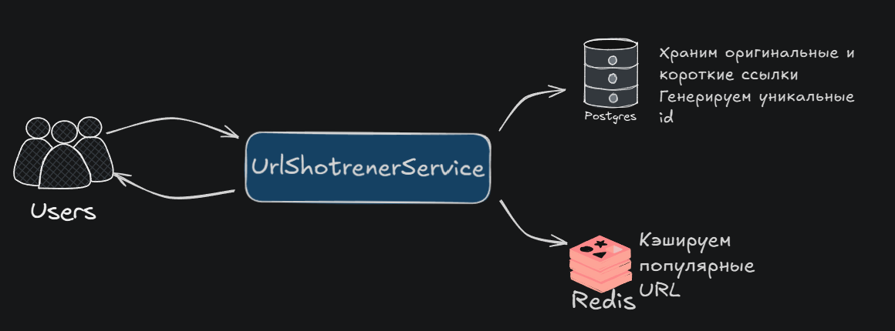
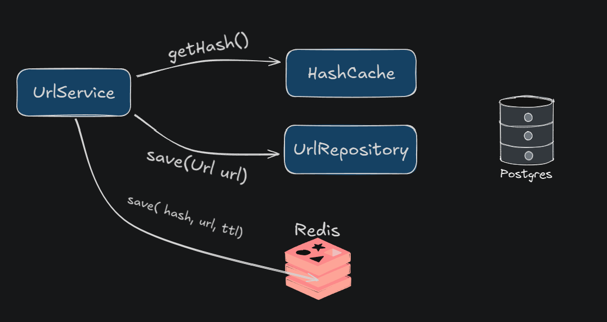
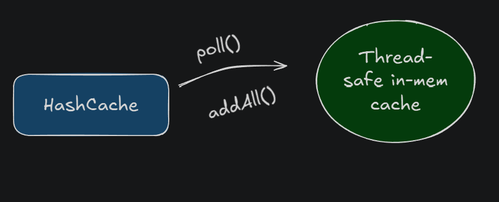
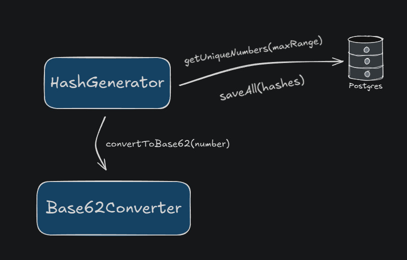

# Url shortener

# Общий дизайн

1. Сервис URL Shortener на Spring Boot.
2. База данных Postgres. В ней хранятся связи между короткими и оригинальными URL, а также она используется для
генерации уникальных id.
3. Redis для кэширования недавно созданных и популярных коротких URL и их оригинальных версий. Redis испоьзуется для
быстрого доступа к популярным ссылкам и снижения нагрузки на базу данных.
4. Планировщик для переиспользования ресурсов, который будет переодически проверять базу данных и удалять старые ссылки,
чтобы освободить место в базе данных.

# Структура классов

1. REST Controller - UrlController. Контроллер который принимает запросы пользователя на генерацию нового сокращенного
URL, а также для получения оригинальной ссылки из короткой.
2. UrlService. Используется контроллером для генерации коротких URL-адресов и их сохранения в базе данных и Redis,
получения оригинальных URL-адресов из коротких и проверки их на наличие в Redis и в базе данных.
3. HashCache. Содержит логику генерации хэшей (ключей) для коротких ссылок из уникальных целых чисел, полученных из БД.
Работает по алгоритму base62.
4. CleanerScheduler. Содержит джобу для удаления устаревших коротких ссылок и перемещения их хэшей
обратно в БД.
5. UrlRepository. Класс для получения/сохранения ассоциаций коротких и длинных ссылок в БД.
6. HashRepository. Класс для получения/сохранения сгенерированных хэшей в БД

# Создание короткой ссылки

Пользователь отправляет POST запрос с телом, содержащим оригинальный длинный URL. Класс URLController принимает этот
запрос, проводит валидацию переданного URL и передает его в URLService.

URLService, получив url, обращается в HashCache для получения хэша, который будет ассоциирован с этим длинным url.
Генерирует хэши заранее и хранит в локальном кэше, чтобы не генерировать новый на каждый запрос. Это значительно ускорит
работу сервиса.
URLService берет полученный хэш и оригинальный url и сохраняет их в БД в таблицу urls. Также он сохраняет хэш и url
в Redis.

Когда все данные успешно сохранены, то URLService просто возвращает хэш в URLController, который формирует из него
ответ, добавляя к нему статический адрес сервиса.

# HashCache

URLService вызывает метод getHash у HashCache для получения случайного уникального хэша. Здесь HashCache обращается к
своей внутренней коллекции, из которой он без задержки получает и удаляет случайный хэш.

Если заполненность достигла 20%(можно менять в конфиге) от максимальной, то он асинхронно отправляет запрос в БД на
получение новой пачки хэшей и заполняет ими коллекции.

Каждый раз, когда HashCache асинхронно обращается за новой пачкой хэшей в БД, он также асинхронно запускает еще одну
операцию: генерацию еще большего количества хэшей в БД.
Получив уникальные числа, HashGenerator передает их в класс Base62Encoder, который из каждого числа генерирует хэш
по алгоритму base62.
Далее HashGenerator получившиеся хэши сохраняет в БД в таблицу hash.

# Получение оригинальной ссылки

Пользователь отправляет GET запрос к сервису, который принимает URLController и вынимает hash из path variable.
Затем передает его в URLService

URLService сначала обращается к Redis, чтобы проверить, нет ли там популярного закэшированного url.
Если что-то нашлось в Redis - тут же возвращает результат в URLController. Если ничего не нашёл, то пробует уже найти в
базе. Если нашёл, то возвращает в контроллер. Если и там нет, был передан несуществующий хэш, и кидает
пользователю ошибку.

URLController, получив ответ от URLService, заворачивает его в HTTP response со статусом 302, добавляя, куда именно
произойдет редирект пользователя - на длинный URL, который он только что получил.

Если же из URLService в контроллер вернулась ошибка, то он сформирует соответствующий ответ пользователю со статусом
Bad Request.

# Как работает удаление старых URL

CleanerScheduler - это класс, который запускается как джоба раз в день(можно поменять в конфиге), находит в БД все URL,
которые были созданы больше года(можно поменять в конфиге) назад и удаляет их из таблицы url. Экономия места.
Вместо полностью удаления данных из url таблицы, хэши всех удаляемых строк переносятся в таблицу hash, где лежат
все свободные. Ресурсы не теряются.
Хэши никогда не задублируются, потому что sequence в БД - это монотонно возрастающая последовательность,
и в ней не может быть дубликатов.